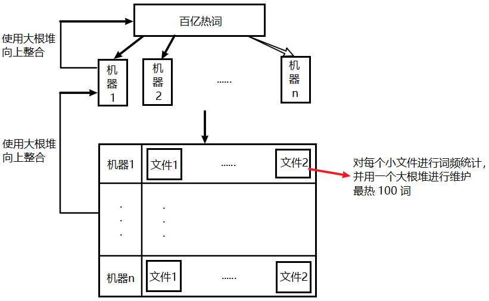
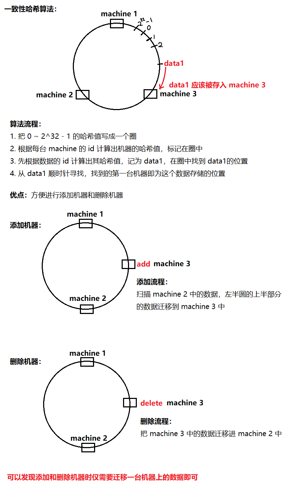

# 大数据

<!-- TOC -->

- [大数据](#大数据)
    - [海量日志数据，提取出某日访问百度次数最多的那个 IP【Top 1 频次】](#海量日志数据提取出某日访问百度次数最多的那个-iptop-1-频次)
    - [统计最热门的 10 个查询串 (1 - 255 字节)，内存限制 1G【Top K 频次】](#统计最热门的-10-个查询串-1---255-字节内存限制-1gtop-k-频次)
    - [10 个 1G 文件，文件的每一行存的是用户的 query，按照 query 的频度排序](#10-个-1g-文件文件的每一行存的是用户的-query按照-query-的频度排序)
    - [给定 a、b 两个文件，各存放 50 亿个 url，每个 url 占 64 字节，内存限制 4G，找出 a、b 文件共同的 url](#给定-ab-两个文件各存放-50-亿个-url每个-url-占-64-字节内存限制-4g找出-ab-文件共同的-url)
    - [在 2.5 亿个整数中找出不重复的整数，内存不足以容纳这 2.5 亿个整数](#在-25-亿个整数中找出不重复的整数内存不足以容纳这-25-亿个整数)
    - [给 40 亿个不重复的无排序 unsigned int 整数，如何快速判断一个数是否在这 40 亿个数中](#给-40-亿个不重复的无排序-unsigned-int-整数如何快速判断一个数是否在这-40-亿个数中)
    - [哈希函数](#哈希函数)
    - [Map-Reduce](#map-reduce)
    - [案例一](#案例一)
    - [案例二](#案例二)
    - [案例三](#案例三)
    - [案例四](#案例四)
    - [案例五](#案例五)
    - [案例六](#案例六)
        - [一致性哈希算法](#一致性哈希算法)

<!-- /TOC -->

## 海量日志数据，提取出某日访问百度次数最多的那个 IP【Top 1 频次】

IP 地址最多有 `2^32 = 4G` 种情况，内存应该是放不下的，可以通过 Hash + 分而治之的思想解决：

- 通过 `Hash(IP) % 1024` 的结果将 IP 记录的数据分为 1024 个文件；
- 分别处理每个文件，给每个文件建立一个 HashMap，key 是 IP 值，value 是出现的次数，然后遍历所有的 key 找出当前文件中出现频次最多的 IP，并记录这个 IP 和它出现的频次；
- 从 1024 个 IP 和出现的频次中找出出现次数最多的 IP。


## 统计最热门的 10 个查询串 (1 - 255 字节)，内存限制 1G【Top K 频次】

假设目前有 1 千万个记录（这些查询串的重复度比较高，虽然总数是 1 千万，但除去重复后，不超过 3 百万个。一个查询串的重复度越高，说明查询它的用户越多，也就是越热门），请你统计最热门的 10 个查询串，要求使用的内存不能超过 1G。

- 先使用上一道题的 Hash + 分而治之的思想，将 1 千万个记录通过 `Hash(记录) % 1024` 的结果将记录数据分为 1024 个文件；

- 然后建一个大小为 10 的堆，堆中的元素是一个 QueryEntry，堆根据 QueryEntry 的 frequency 进行排序，分别处理这 1024 个文件，给每个文件建立一个 HashMap，key 是查询串，value 是查询串出现的次数，然后遍历所有的 key，为每个 key 新建一个 QueryEntry，并将其 add 进堆中；

	```java
	class QueryEntry {
	    String queryStr;
	    String frequency;
	}
	```

- 最后堆中剩下的就是最热门的 10 个查询串。


## 10 个 1G 文件，文件的每一行存的是用户的 query，按照 query 的频度排序

1. 顺序读取 10 个文件，按照 `hash(query) % 10` 的结果将 query 写入到另外 10 个文件中。这样新生成的文件每个的大小大约也1G（假设 hash 函数是随机的）。
2. 找一台内存在 2G 左右的机器，依次对用 `HashMap<query, query_count>` 来统计每个 query 出现的次数。利用快速/堆/归并排序按照出现次数进行排序。将排序好的 query 和对应的 query_cout 输出到文件中。这样得到了 10 个排好序的文件。
3. 对这 10 个文件进行归并排序（内排序与外排序相结合）。


## 给定 a、b 两个文件，各存放 50 亿个 url，每个 url 占 64 字节，内存限制 4G，找出 a、b 文件共同的 url

每个文件的大小为：5G * 64 = 320G，远远大于内存限制的 4G。所以不可能将其完全加载到内存中处理。考虑采取分而治之的方法。

**方案一**

遍历文件 a，对每个 url 求取 `hash(url) % 1000`，然后根据所取得的值将 url 分别存储到 1000 个小文件（记为 a0, a1, ..., a999）中。这样每个小文件的大约为 300M。

遍历文件 b，采取和a相同的方式将 url 分别存储到 1000 小文件（记为b0, b1, ..., b999）。这样处理后，所有可能相同的 url 都在对应的小文件（a0 vs b0, a1 vs b1, ..., a999 vs b999）中，不对应的小文件不可能有相同的 url。然后我们只要求出 1000 对小文件中相同的 url 即可，这个问题就可以用 HashMap 解决了。

**方案二**

如果允许有一定的错误率，可以使用 Bloom filter，4G 内存大概可以表示 340 亿 bit。将其中一个文件中的 url 使用 Bloom filter 映射为这 340 亿 bit，然后挨个读取另外一个文件的 url，检查是否与 Bloom filter，如果是，那么该 url 应该是共同的url（注意会有一定的错误率）。


## 在 2.5 亿个整数中找出不重复的整数，内存不足以容纳这 2.5 亿个整数

**方案一**

采用 2-Bitmap（每个数分配 2 bit，00 表示不存在，01 表示出现一次，10 表示多次，11 无意义）进行，共需内存 `2^32 * 2 bit = 1G` 内存，还可以接受。然后扫描这 2.5 亿个整数，查看 Bitmap 中相对应位，如果是 00 变 01，01 变 10，10 保持不变。所描完事后，查看 bitmap，把对应位是 01 的整数输出即可。

**方案二**

也可采用与第 1 题类似的方法，进行划分小文件的方法。然后在小文件中找出不重复的整数，并排序。然后再进行归并，注意去除重复的元素。


## 给 40 亿个不重复的无排序 unsigned int 整数，如何快速判断一个数是否在这 40 亿个数中

**方案一**

按照集合中最大元素 max 创建一个长度为 max + 1 的新数组，然后再次扫描原数组，遇到几就给新数组的第几位置为 1，例如，遇到 5 就给新数组的第 6 个元素置 1，这样下次再遇到 5 想置位时发现新数组的第 6 个元素已经是 1 了，这说明这次的数据肯定和以前的数据存在着重复。这种给新数组初始化时置零其后置一的做法类似于位图的处理方法故称位图法。它的运算次数最坏的情况为 2N。

**方案二**

分而治之的思想，将这 40 亿个数分成两类：

- 最高位为 0
- 最高位为 1

并将这两类分别写入到两个文件中，其中一个文件中数的个数 <= 20 亿，而另一个 >= 20 亿（这相当于折半了），接下来与要查找的数的最高位比较并接着进入相应的文件再查找，以此类推，持续进行折半查找。


## 哈希函数

**特点：**

- 基础
	- 无限的输入域，有限的输出域
	- 相同的输入值会得到相同的输出值
	- 不同的输入值可能得到不同的输出值，也可能得到相同的输出值
- 评价优劣
	- 不同的输入值得到的输出值尽可能均匀的分布在输出域上

**哈希函数的经典实现：**MD5, SHA1


## Map-Reduce

Map-Reduce 分为两个步骤：

- Map 阶段：把大任务分成子任务
- Reduce 阶段：子任务并发处理，然后合并结果

**简单应用案例：**统计一篇文章中每个单词出现的次数


## 案例一

> **题目：**对 10 亿个 IPV4 IP 地址排序（地址无重复）。

用 bitmap，就是一个长度为$2^{32}$的比特数组，每个位置代表一个 IP，出现过就置 1，没出现过就置 0，然后扫描整个比特数组，得到被置 1 位置代表的 IP 即可，类似计数排序。


## 案例二

> **题目：**对 10 亿人的年龄进行排序。

在 0 ~ 200 进行计数排序。


## 案例三

> **题目：**找出一个存有 20 亿个 32 位整数的大文件中出现次数最多的数（内存限制 2G）。

如果用 hashmap，key (4B) + value (4B) = 8B，20 亿个数最多可能需要 20 亿个键值对，需要 14.9G 左右的空间，显然这种方法是不行的。

使用哈希函数进行分流，将文件中的整数分成 8 个文件，因为相同的数产生的哈希值是一样的，我们不会把相同的数分去不同的文件，并且哈希函数的输出是均匀的，所以每个文件的大小应该相差无几，然后在对每个小文件进行统计，最后返回 8 个文件中出现次数最多的数中出现次数最多的那个数。


## 案例四

> **题目：**32 位无符号整数（0 ~ 4294967295），现在有一个包含 40 亿无符号整数的文件，用 10M 内存找出一个没出现过的数（找出一个即可）。

把 0 ~ 4294967295 分成 16 个小段，给每段建立一个 bitmap。


## 案例五

> **题目：**百亿搜索词，找出每天最热的 100 词。

用到的方法：分流 + 大根堆




## 案例六

> **题目：**使用服务器集群来设计和实现数据缓存，常见策略有：
>
> - 增查删都先将数据的 id 转换成哈希值 key
> - 计算 key%N 找到该数据所属的机器编号
>
> 这样做有什么潜在问题，更好的做法是怎样的。

**潜在问题：**增加删除机器的代价很高，因为通过 %N 来计算数据的归属机器，一旦 N 发生了变化，要对所有机器上的数据归属进行重新分配。

**解决方法：**一致性哈希算法。

### 一致性哈希算法



