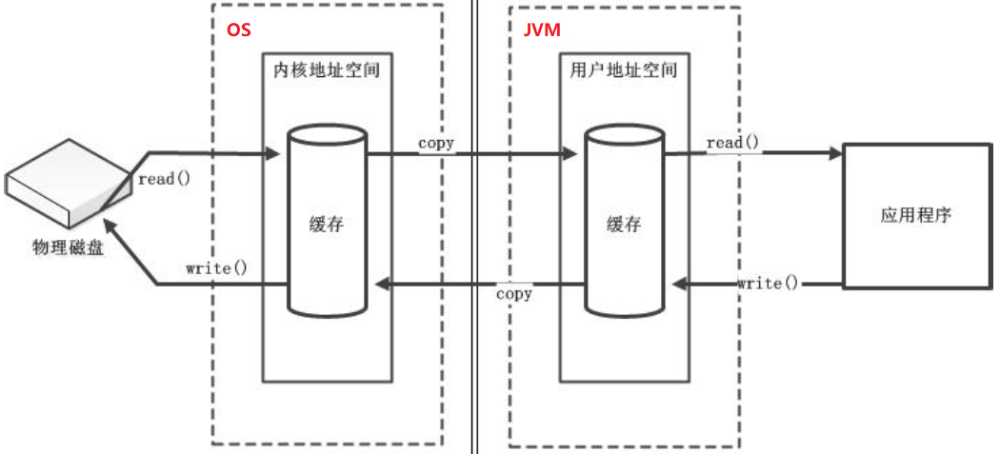
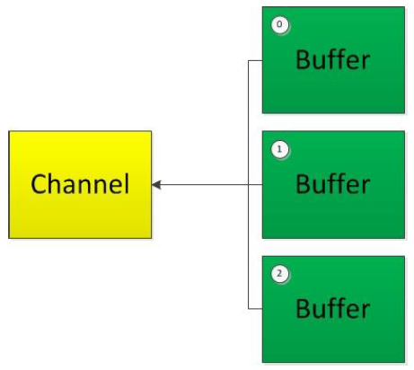

# Java NIO

NIO，就是 New IO，是非阻塞 IO。支持面向缓冲区，基于通道的 IO 操作。

传统的 IO 是面向流的，并且是单向的。如果要进行双工的通信，要建立两个流，一个输入流，一个输出流。

NIO 是面向缓冲区的，是双向的，通信双方建立一个通道，然后把数据存放在缓冲区中，然后缓冲区在通道中流动进行数据的传输。打个比方，通道 —— 铁路，缓冲区 —— 火车，数据 —— 人，一堆人想要从 A 地到达 B 地，首先需要把人装上火车，然后火车在铁路上从 A 地跑到 B 地，实现将人从 A 地运到 B 地；同样的道理，一堆数据如果想要从 A 地运到 B 地，需要先把数据装入缓冲区，然后将缓冲区从 A 地跑到 B 地，从而实现将数据从 A 地运到 B 地。


## 缓冲区 Buffer

首先，有这些个 Buffer 种类：

- ByteBuffer
- CharBuffer
- ShortBuffer
- IntBuffer
- LongBuffer
- FloatBuffer
- DoubleBuffer

*简而言之就是，8 个基本类型，除了 reference 都有相应类型的缓冲区在。*

### 缓冲区中的核心属性

```java
// Invariants: mark <= position <= limit <= capacity
private int mark = -1;    // 可以记录当前 position 的位置，然后调用 reset()，可以把 position 恢复到这个位置
private int position = 0; // 缓冲区中正在操作的数据的位置
private int limit;        // 缓冲区中可以操作数据的大小，limit 后的数据是不能进行读写的
private int capacity;     // 缓冲区中最大存储数据的容量，一旦声明不能改变 
```

> **Note：** 抽象类虽然自身不可以实例化，但是其子类覆盖了所有的抽象方法后，是可以实例化的，所以抽象类的构造函数，适用于给其子类对象进行初始化的。
>
> 所以对于 `ByteBuffer.allocate()` 方法，实际上是新建了一个 ByteBuffer 抽象类的子类 HeapByteBuffer 对象，HeapByteBuffer 类实现了 ByteBuffer 的所有抽象方法，所以我们可以通过调用 ByteBuffer 抽象类的构造函数来初始化 HeapByteBuffer 对象。

### 直接缓冲区与非直接缓冲区

|              | 非直接缓冲区              | 直接缓冲区                                         |
| ------------ | ------------------------- | -------------------------------------------------- |
| **分配方法** | `allocate()`              | `allocateDirect()`                                 |
| **特点**     | 将缓冲区建立在 JVM 内存中 | 将缓冲区建立在物理内存 (直接内存) 中，可以提高效率 |

可以通过 `isDirect()` 来判断当前的缓冲区是不是直接缓冲区。

**为什么使用直接缓冲区可以提高效率呢？**

正常情况下，如果你想将一些数据写到物理磁盘上，你需要先将数据从 JVM 内存中 copy 到内核地址空间，因为内核才真正具有控制计算机硬件资源的功能，用户态运行的上层应用程序只能通过系统调用来让内核态的资源来帮助将数据写入硬盘。


当要将一个超大的文件写到硬盘上时，这个 copy 的操作就显得很费时了。



而使用直接内存，我们可以操作物理磁盘在内存中的内存映射文件，来直接将物理硬盘上的数据加载进内存，或者将内存中的写入硬盘中，而这个映射，其实是一个物理地址到逻辑地址的转换（或者逆过程）。


### 常用方法代码示例

```java
public class BufferDemo {
    private ByteBuffer buffer = ByteBuffer.allocate(1024);
    private ByteBuffer directBuffer = ByteBuffer.allocateDirect(1024);

    /**
     * 打印 buffer 的 4 大核心属性
     */
    @Test
    public void test0() {
        System.out.println(buffer.position());
        System.out.println(buffer.limit());
        System.out.println(buffer.capacity());
        System.out.println("---------------------");
    }

    /**
     * Test put, get, flip, rewind,
     */
    @Test
    public void test1() {
        String str = "abcde";
        /* put：向缓冲区中写入数据 */
        buffer.put(str.getBytes());
        System.out.println(buffer.position()); // 5
        System.out.println(buffer.limit());    // 1024
        System.out.println(buffer.capacity()); // 1024
        System.out.println("---------------------");

        /* flip：将缓冲区从写状态切换到读状态 */
        buffer.flip();
        System.out.println(buffer.position()); // 0
        System.out.println(buffer.limit());    // 5
        System.out.println(buffer.capacity()); // 1024
        System.out.println("---------------------");

        /* get：从缓冲区中读数据出来 */
        byte[] tmp = new byte[2];
        buffer.get(tmp);
        System.out.println("get result: " + new String(tmp));
        System.out.println(buffer.position());  // 2
        System.out.println(buffer.limit());     // 5
        System.out.println(buffer.capacity());  // 1024
        System.out.println(buffer.remaining()); // 3，看看还有多少元素可读
        System.out.println("---------------------");

        /* mark：记录当前 position 的位置到 mark 变量 */
        /* reset：令 position = mark */
        buffer.mark();
        buffer.get(tmp);
        System.out.println("get result: " + new String(tmp));
        System.out.println("before reset: position = " + buffer.position()); // 4
        buffer.reset();
        System.out.println("after reset: position = " + buffer.position());  // 2
        System.out.println("---------------------");

        /* rewind：令 position = 0，就是个倒带的操作 */
        buffer.rewind();
        System.out.println(buffer.position());  // 0
        System.out.println(buffer.limit());     // 5
        System.out.println(buffer.capacity());  // 1024
        System.out.println(buffer.remaining()); // 5
        System.out.println("---------------------");
        
        /* compact：从读状态切换回写状态，可以接着上回写的地方继续往下写 */
        buffer.compact();
        System.out.println(buffer.position());  // 5
        System.out.println(buffer.limit());     // 1024
        System.out.println(buffer.capacity());  // 1024
        System.out.println(buffer.remaining()); // 1019
        System.out.println("---------------------");
                
        /* clear，实际上并没有将数据真的清除，只有当新的数据把旧的数据覆盖了，旧的数据才真的被清除 */
        buffer.clear();
        System.out.println(buffer.position());  // 0
        System.out.println(buffer.limit());     // 1024
        System.out.println(buffer.capacity());  // 1024
        System.out.println(buffer.remaining()); // 1024
        System.out.println("---------------------");

        /* isDirect：判断缓冲区是不是直接内存缓冲区 */
        System.out.println(buffer.isDirect());       // false
        System.out.println(directBuffer.isDirect()); // true
        System.out.println("---------------------");
    }
}
```


## 通道 Channel

用于连接两个节点。在 NIO 中负责缓冲区中数据的传输，它本身是不能存储数据的。

### 主要实现类

- `java.nio.channels.Channel` 接口
  - 本地传输：
    - FileChannel
  - 网络传输：
    - SocketChannel
    - ServerSocketChannel
    - DatagramChannel

### 获取通道

Java 中以下类拥有 `getChannel()` 方法，可以通过这个方法获取对应的通道。

- 本地 IO
	- FileInputStream / FileOutputStream
	- RandomAccessFile
- 网络 IO
	- Socket
	- ServerSocket
	- DatagramSocket

除此之外，JDK 1.7 中的 AIO 还提供了以下两种获取通道的方式：

- 为各个通道提供了静态方法 `open()`
- `Files.newByteChannel()`

### 通道之间的数据传输

- `transferFrom()`
- `transferTo()`

### 分散读取与聚集写入

就是以前是用一个缓冲区协助通道传输数据，Scatter 和 Gather 就是用一堆缓冲区（缓冲区数组）协助通道传输数据。

| 分散读取 Scattering Reads：按照缓冲区的顺序，将从 Channel 中读取的数据依次将 Buffer 填满。 | 聚集写入 Gathering Writes：按照缓冲区的顺序，写入position 和 limit 之间的数据到 Channel 。 |
| ------------------------------------------------------------ | ------------------------------------------------------------ |
|                           |                           |

### 代码示例

```java
public class ChannelDemo {
    /**
     * 利用通道完成文件的复制（非直接缓冲区）
     */
    @Test
    public void copyFile1() {
        FileInputStream in = null;
        FileOutputStream out = null;
        FileChannel inChannel = null;
        FileChannel outChannel = null;
        try {
            in = new FileInputStream("1.png");
            out = new FileOutputStream("2.png");
            inChannel = in.getChannel();
            outChannel = out.getChannel();
            ByteBuffer buffer = ByteBuffer.allocate(1024);
            while (inChannel.read(buffer) != -1) {
                buffer.flip();
                outChannel.write(buffer);
                buffer.clear();
            }
        } catch (FileNotFoundException e) {
            e.printStackTrace();
        } catch (IOException e) {
            e.printStackTrace();
        } finally {
            try {
                if (in != null) {
                    in.close();
                }
                if (out != null) {
                    out.close();
                }
                if (inChannel != null) {
                    inChannel.close();
                }
                if (outChannel != null) {
                    out.close();
                }
            } catch (IOException e) {
                e.printStackTrace();
            }
        }
    }

    /**
     * 使用直接缓冲区完成文件的复制(内存映射文件)，通过 Channel 的 map 方法获取的缓冲区就是直接缓冲区
     */
    @Test
    public void copyFile2() {
        FileChannel inChannel = null;
        FileChannel outChannel = null;
        try {
            inChannel = FileChannel.open(Paths.get("1.png"), StandardOpenOption.READ);
            outChannel = FileChannel.open(Paths.get("2.png"), StandardOpenOption.WRITE,
                    StandardOpenOption.READ, StandardOpenOption.CREATE);
            MappedByteBuffer inBuffer = inChannel.map(
                FileChannel.MapMode.READ_ONLY, 0, inChannel.size());
            MappedByteBuffer outBuffer = outChannel.map(
                FileChannel.MapMode.READ_WRITE, 0, inChannel.size());

            byte[] dst = new byte[inBuffer.limit()];
            inBuffer.get(dst);
            outBuffer.put(dst);
        } catch (IOException e) {
            e.printStackTrace();
        } finally {
            if (inChannel != null) {
                try {
                    inChannel.close();
                } catch (IOException e) {
                    e.printStackTrace();
                }
            }
            if (outChannel != null) {
                try {
                    outChannel.close();
                } catch (IOException e) {
                    e.printStackTrace();
                }
            }
        }
    }

    /**
     * 通道之间的数据 transfer (直接缓冲区)
     */
    @Test
    public void copyFile3() {
        FileChannel inChannel = null;
        FileChannel outChannel = null;
        try {
            inChannel = FileChannel.open(Paths.get("1.png"), StandardOpenOption.READ);
            outChannel = FileChannel.open(Paths.get("2.png"), StandardOpenOption.WRITE,
                    StandardOpenOption.READ, StandardOpenOption.CREATE);
            // 以下两行效果相等
            inChannel.transferTo(0, inChannel.size(), outChannel);
            outChannel.transferFrom(inChannel, 0, inChannel.size());
        } catch (IOException e) {
            e.printStackTrace();
        } finally {
            if (inChannel != null) {
                try {
                    inChannel.close();
                } catch (IOException e) {
                    e.printStackTrace();
                }
            }
            if (outChannel != null) {
                try {
                    outChannel.close();
                } catch (IOException e) {
                    e.printStackTrace();
                }
            }
        }
    }
}
```


## 阻塞与非阻塞


### NIO 完成网络通信的三个核心

- 通道（Channel）：负责连接。
	- SocketChannel
	- ServerSocketChannel
	- DatagramChannel
	- Pipe.SinkChannel
	- Pipe.SourceChannel
- 缓冲区（Buffer）：负责数据存取。
- 选择器（Selector）：是 SelectableChannel 的多路复用器，用于监控 SelectableChannel 的 IO 状况。


## DatagramChannel


## 管道 Pipe

Java NIO 的 Pipe 可以在两个线程之间建立单项的数据连接，管道有一个 `Pipe.SinkChannel` 和 一个 `Pipe.SourceChannel`，数据会被写到 `Pipe.SinkChannel`，然后从 `Pipe.SourceChannel` 中读取。

### 代码示例

```java
public class NioPipeDemo {
    @Test
    public void test() throws IOException {
        Pipe pipe = Pipe.open();
        Pipe.SinkChannel sinkChannel = pipe.sink();

        String str = "我是管道发来的数据";
        ByteBuffer byteBuffer = ByteBuffer.allocate(1024);
        byteBuffer.put(str.getBytes());
        byteBuffer.flip();
        while (byteBuffer.hasRemaining()) {
            sinkChannel.write(byteBuffer);
        }

        Pipe.SourceChannel sourceChannel = pipe.source();
        byteBuffer.clear();
        int len = sourceChannel.read(byteBuffer);
        System.out.println(new String(byteBuffer.array(), 0, len));

        sinkChannel.close();
        sourceChannel.close();
    }
}
```


