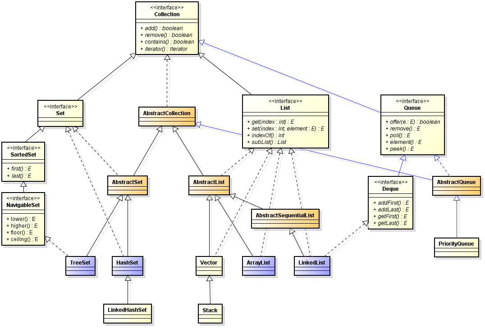
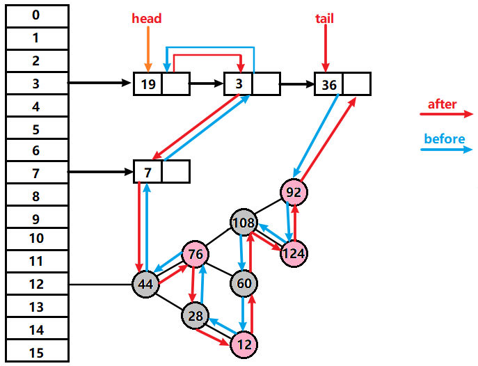

# Java 集合

<!-- TOC -->

- [Java 集合](#java-%E9%9B%86%E5%90%88)
  - [ArrayList、LinkedList 、Vector](#arraylistlinkedlist-vector)
    - [ArrayList 与 LinkedList 异同](#arraylist-%E4%B8%8E-linkedlist-%E5%BC%82%E5%90%8C)
    - [ArrayList 与 Vector 区别](#arraylist-%E4%B8%8E-vector-%E5%8C%BA%E5%88%AB)
  - [HashMap、HashTable、TreeMap](#hashmaphashtabletreemap)
    - [基本区别](#%E5%9F%BA%E6%9C%AC%E5%8C%BA%E5%88%AB)
    - [HashMap 源码分析](#hashmap-%E6%BA%90%E7%A0%81%E5%88%86%E6%9E%90)
    - [TreeSet](#treeset)
  - [ConcurrentHashMap](#concurrenthashmap)
    - [特点](#%E7%89%B9%E7%82%B9)
    - [锁分段实现原理](#%E9%94%81%E5%88%86%E6%AE%B5%E5%AE%9E%E7%8E%B0%E5%8E%9F%E7%90%86)
    - [注意](#%E6%B3%A8%E6%84%8F)
    - [JDK 1.8 的改变](#jdk-18-%E7%9A%84%E6%94%B9%E5%8F%98)
  - [LinkedHashMap](#linkedhashmap)
  - [HashSet](#hashset)
  - [迭代器 Iterator](#%E8%BF%AD%E4%BB%A3%E5%99%A8-iterator)

<!-- /TOC -->

**Collection**



**Map**


## ArrayList、LinkedList 、Vector

### ArrayList 与 LinkedList 异同

- **相同点：**
	- 都实现了 List 接口。
	- 都是线程不安全的。
- **不同点：**
	- **底层实现：** ArrayList 底层使用的是 Object 数组；LinkedList 底层使用的是双向链表数据结构，维护一个 head 指针和一个 tail 指针（JDK 1.6 之前为循环链表）。
		- 为啥要改？因为在链表头 / 尾进行插入 / 删除操作时，循环链表需要处理两头的指针，而非循环链表只需要处理一边，更高效，同时在两头（链头 / 链尾）操作是最普遍的。
	- **基本操作的时间复杂度：** ArrayList 可以高效的访问元素 O(1)，但是不能高效的插入和删除元素 O(n)；LinkedList 可以高效的插入和删除元素 O(1)，但是不能高效访问的元素 O(n)。
	- **内存空间占用：** ArrayList 的空间浪费主要体现在在 list 列表的结尾会预留一定的容量空间；而 LinkedList 的空间花费则体现在它的每一个元素都需要消耗比 ArrayList 更多的空间。

> **补充：RandomAccess 接口**
>
> RandomAccess 接口里啥都没有，和 Serializable 接口一样，是个标识接口。它标识实现这个接口的类具有随机访问功能。
>
> 这个标识有啥用？在 `Collections.binarySearch()` 方法里有用：
>
> ```java
> public static <T> int binarySearch(List<? extends Comparable<? super T>> list, T key) {
>     if (list instanceof RandomAccess || list.size()<BINARYSEARCH_THRESHOLD)
>         return Collections.indexedBinarySearch(list, key);
>     else
>         return Collections.iteratorBinarySearch(list, key);
> }
> ```
>
> 在 `binarySearch()` 方法中，它要判断传入的 list 是否 RamdomAccess 的实例，如果是，调用 `indexedBinarySearch()` 方法，如果不是，那么调用 `iteratorBinarySearch()` 方法
>
> `indexedBinarySearch()` 方法和 `iteratorBinarySearch()` 方法的区别在于：需要使用 `iteratorBinarySearch()` 方法的集合，是直接通过索引 i 取变量的，而需要使用 `iteratorBinarySearch()` 方法的集合要取到这个集合的迭代器用来取元素：
>
> ```java
> ListIterator<? extends Comparable<? super T>> i = list.listIterator();
> while (low <= high) {
>     int mid = (low + high) >>> 1;
>     Comparable<? super T> midVal = get(i, mid); // 取元素
>     ...
> }
> ```

### ArrayList 与 Vector 区别

Vector 类是线程安全的，不过它保证线程安全的方法十分的简单粗暴，就是给所有会出现线程安全问题的方法都加上 `synchronized` 修饰，所以超慢的……


## HashMap、HashTable、TreeMap

> **hash 算法**
>
> - 加法 Hash：把输入元素一个一个的加起来构成最后的结果。
> - 位运算 Hash：这类型 Hash 函做通过利用各种位运算（常见的是移位和异或）来充分的混合输入元素。
> - 乘法 Hash：这种类型的 Hash 函数利用了乘法的不相关性（乘法的这种性质，最有名的莫过于平方取关尾的随机数生成算法，虽然这种算法效果并不好]；jdk5.0 里面的 String 类的 hashCode() 方法也使用乘法Hash；32 位 FNV 算法
> - 除法 Hash：除法和乘法一样，同样具有表面上看起来的不相关性。不过，因为除法太慢，这种方式几乎找不到真正的应用
> - 查表 Hash：查表 Hash 最有名的例子莫过于 CRC 系列算法。虽然 CRC 系列算法本身并不是查表，但是，查表是它的一种最快的实现方式。查表 Hash 中有名的子有：Universal Hashing 和 Zobrist Hashing。他们的表格都是随机生成的。
> - 混合 Hash：混合 Hash 算法利用了以上各种方式。各种常见的 Hash 算法，比如 MD5、Tiger 都属于这个范围。它们一般很少在面向查找的 Hash 函做里面使用

### 基本区别

它们都是最常见的 Map 实现，是以键值对的形式存储数据的容器类型。

- **HashTable：** 线程安全，不支持 null 作为键或值，它的线程安全是通过在所有存在线程安全问题的方法上加 synchronized 实现的，所以性能很差，很少使用。
- **HashMap：** 不是线程安全的，但是支持 null 作为键或值，是绝大部分利用键值对存取场景的首选，put 和 get 基本可以达到常数级别的时间复杂度。
- **TreeMap：** 基于红黑是的一种提供顺序访问的 Map，它的 get，put，remove 等操作是 O(log(n)) 级别的时间复杂度的（因为要保证顺序），具体的排序规则可以由 Comparator 指定：`public TreeMap(Comparator<? super K> comparator)`。

> **HashMap 和 HashTable 的区别总结：**
>
> - **线程是否安全：** HashMap 是非线程安全的，HashTable 是线程安全的；HashTable 内部的方法基本都经过 synchronized 修饰。（如果你要保证线程安全的话就使用 ConcurrentHashMap 吧！）；
>
> - **效率：** HashMap 要比 HashTable 效率高。
>
> - **对 null key 和 null value 的支持：** HashMap 中，null 可以作为键，这样的键只有一个，可以有一个或多个键所对应的值为 null。但是在 HashTable 中 put 进的键值只要有一个 null，直接抛出 NullPointerException。
>
> - **初始容量大小和每次扩充容量大小的不同：** 
>
> 	- 创建时不指定容量初始值：Hashtable 默认的初始大小为 11，之后每次扩充，容量变为原来的 2n+1。HashMap  默认的初始化大小为 16。之后每次扩充，容量变为原来的 2 倍。
>
> 	- 创建时给定了容量初始值：Hashtable 会直接使用你给定的大小，而 HashMap 会使用 tableSizeFor 方法将其扩充为 2 的幂次方大小。
>
> 		```java
> 		static final int tableSizeFor(int cap) {
> 		    int n = cap - 1;
> 		    n |= n >>> 1;
> 		    n |= n >>> 2;
> 		    n |= n >>> 4;
> 		    n |= n >>> 8;
> 		    n |= n >>> 16;
> 		    return (n < 0) ? 1 : (n >= MAXIMUM_CAPACITY) ? MAXIMUM_CAPACITY : n + 1;
> 		}
> 		```
>
> - **底层数据结构：** JDK1.8 以后的 HashMap 在解决哈希冲突时有了较大的变化，当链表长度大于阈值（默认为 8）时，将链表转化为红黑树，以减少搜索时间。Hashtable 没有这样的机制。

> **HashMap 的长度为什么要是 2 的幂次方呢？**
>
> 因为 hashCode 是 -2147483648 到 2147483647 的，超大的，在决定一个元素在哈希表中的真正位置时是要进行 `hashCode % n` 的运算的（n 是存元素的哈希数组的长度），如果 n 是 2 的幂次方的话，这个操作是可以用位运算来解决的：`(n - 1) & hash`，位运算快啊！

在对 Map 的顺序没有要求的情况下，HashMap 基本是最好的选择，不过 HashMap 的性能十分依赖于 hashCode 的有效性，所以必须满足：

- equals 判断相等的对象的 hashCode 一定相等
- 重写了 hashCode 必须重写 equals

我们注意到，除了 TreeMap，LinkedHashMap 也可以保证某种顺序，它们的 **区别** 如下：

- LinkedHashMap：提供的遍历顺序符合插入顺序，是通过为 HashEntry 维护一个双向链表实现的。
- TreeMap：顺序由键的顺序决定，依赖于 Comparator。

### HashMap 源码分析

HashMap 的内部结构如下：


> 解决哈希冲突的常用方法：
>
> - 开放地址法：出现冲突时，以当前哈希值为基础，产生另一个哈希值。
> - 再哈希法：同时构造多个不同的哈希函数，发生冲突就换一个哈希方法。
> - 链地址法：将哈希地址相同的元素放在一个链表中，然后把这个链表的表头放在哈希表的对应位置。
> - 建立公共溢出区：将哈希表分为基本表和溢出表两部分，凡是和基本表发生冲突的元素，一律填入溢出表。

HashMap 采用的是链表地址法，不过如果由一个位置的链表比较长了（超过阈值 8 了），链表会被改造为树形结构以提高查找性能。

这个桶数组并没有在 HashMap 的构造函数中初始化好，只是设置了容量（默认初始容量为 16），应该是采用了 lazy-load 原则。

```java
public HashMap(int initialCapacity, float loadFactor){  
    // ... 
    this.loadFactor = loadFactor;
    this.threshold = tableSizeFor(initialCapacity);
}
```

接下来，我们看一下 put 方法：

```java
public V put(K key, V value) {
    return putVal(hash(key), key, value, false, true);
}
```

可以看到，put 方法调用了 putVal 方法：

```java
final V putVal(int hash, K key, V value, boolean onlyIfAbsent,
               boolean evict) {
    Node<K,V>[] tab; Node<K,V> p; int n, i;
    // lazy-load，tab要是空的，用resize初始化它
    // resize既要负责初始化，又要负责在容量不够时扩容
    if ((tab = table) == null || (n = tab.length) == 0)
        n = (tab = resize()).length;
    // 无哈希冲突，直接new一个节点放到tab[i]就行
    // 具体键值对在哈希表中的位置：i = (n - 1) & hash
    if ((p = tab[i = (n - 1) & hash]) == null)
        tab[i] = newNode(hash, key, value, null);
    else {
        Node<K,V> e; K k;
        // 该key存在，直接修改value就行
        if (p.hash == hash &&
            ((k = p.key) == key || (key != null && key.equals(k))))
            e = p;
        // 当前hashCode下面挂的已经是颗树了，用树的插入方式插入新节点
        else if (p instanceof TreeNode)
            e = ((TreeNode<K,V>)p).putTreeVal(this, tab, hash, key, value);
        // 当前hashCode下面挂的还是个链表，不过保不齐会变成颗树
        else {
            // ...
            if (binCount >= TREEIFY_THRESHOLD - 1) // 链表要变树啦！
                treeifyBin(tab, hash);
            // ...
        }
    }
    ++modCount;
    if (++size > threshold) // 容量不够了，扩容
        resize();
}
```

**分析：**

- key 的 hashCode 用的并不是 key 自己的 hashCode，而是通过 HashMap 内部的一个 hash 方法另算的，这东西叫扰动函数。那么为什么要另算一个 hashCode 呢？这是因为： **有些数据计算出的哈希值差异主要在高位，而 HashMap 里的哈希寻址是忽略容量以上的高位的，这种处理可以有效避免这种情况下的哈希碰撞。**

  ```java
  static final int hash(Object key) {
      int h;
      return (key == null) ? 0 : (h = key.hashCode()) ^ (h >>> 16);
  }
  ```

- **resize 方法：** （重点！这个方法和以前写的有点不一样了……）现在的写法不会出现链表扩容时发生死循环了，以前的写法相当于将 oldTab 上的 Node 一个一个卸下来，然用头插法的方式插入到 newTab 的对应位置，因为用的是头插法，会给链表倒序，这种倒序导致了在多线程时，链表的两个 Node 的 next 可能会互相指向对方，出现死循环（[详见此文](https://mailinator.blogspot.com/2009/06/beautiful-race-condition.html)）。现在的方法是使用尾插法，即不会改变链表原来在 oldTab 挂着的时候的相对顺序，在 `oldTab[j]` 处的链表会根据 hash 值分成 lo 和 hi 两个链表，然后分别挂在 newTab 的 `newTab[j]` 和 `newTab[j + oldCap]` 两个不同的位置。

  ```java
  final Node<K,V>[] resize() {
      Node<K,V>[] oldTab = table;
      // oldTab 的长度，一定是 2 的幂，也就是说，二进制只有一位为 1
      int oldCap = (oldTab == null) ? 0 : oldTab.length;
      int oldThr = threshold;
      int newCap, newThr = 0;
      if (oldCap > 0) {
          // MAXIMUM_CAPACITY = 1 << 30，如果超过这个容量就扩不了容了
          if (oldCap >= MAXIMUM_CAPACITY) {
              threshold = Integer.MAX_VALUE;
              return oldTab;
          }
          // newCap = oldCap << 1，容量变成原来的 2 倍
          else if ((newCap = oldCap << 1) < MAXIMUM_CAPACITY &&
                   oldCap >= DEFAULT_INITIAL_CAPACITY)
              newThr = oldThr << 1; // double threshold
      }
      else if (oldThr > 0) // initial capacity was placed in threshold
          newCap = oldThr;
      else {               // zero initial threshold signifies using defaults
          newCap = DEFAULT_INITIAL_CAPACITY;
          newThr = (int)(DEFAULT_LOAD_FACTOR * DEFAULT_INITIAL_CAPACITY);
      }
      if (newThr == 0) {
          float ft = (float)newCap * loadFactor;
          newThr = (newCap < MAXIMUM_CAPACITY && ft < (float)MAXIMUM_CAPACITY ?
                    (int)ft : Integer.MAX_VALUE);
      }
      threshold = newThr;
      @SuppressWarnings({"rawtypes","unchecked"})
      Node<K,V>[] newTab = (Node<K,V>[])new Node[newCap];
      table = newTab;
      // 把 oldTab 中的数据移到 newTab 中，这里是要进行 rehash 的
      if (oldTab != null) {
          for (int j = 0; j < oldCap; ++j) {
              Node<K,V> e;
              if ((e = oldTab[j]) != null) { // 把 oldTab 中的非 null 元素放到 newTab 去
                  oldTab[j] = null; // 把链表从 oldTab[j] 上取下来
                  if (e.next == null) // oldTab[j] 处只有一个元素
                      newTab[e.hash & (newCap - 1)] = e;
                  else if (e instanceof TreeNode) // oldTab[j] 处是一颗树
                      ((TreeNode<K,V>)e).split(this, newTab, j, oldCap);
                  else { // oldTab[j] 处是一个长度不超过 8 链表
                      Node<K,V> loHead = null, loTail = null;
                      Node<K,V> hiHead = null, hiTail = null;
                      Node<K,V> next;
                      do {
                          next = e.next;
                          /* 重点！！！
                          下面将根据 (e.hash & oldCap) == 0 将原来 oldTab[j] 处的链表分成
                          lo 和 hi 两个链表，为什么要这么分呢？
                          因为挂在 oldTab[j] 处的节点都是 hash % oldCap == j 的，但是现在，
                          hash % newCap 的结果有了以下两种可能：
                          - hash % newCap == j；
                          - hash % newCap == j + oldCap。
                          如何区分这两种情况呢？就是通过 (e.hash & oldCap) == 0 来区分的，
                          - 如果 (e.hash & oldCap) == 0，为 hash % newCap == j；
                          - 如果 (e.hash & oldCap) != 0，为 hash % newCap == j + oldCap。
                          */
                          if ((e.hash & oldCap) == 0) {
                              if (loTail == null) // 第一次执行 do-while 循环
                                  loHead = e; // 用 loHead 记录 oldTab[j] 处链表的第一个 Node
                              else // 非第一次执行 do-while 循环
                                  loTail.next = e; // 把当前节点 e 挂到 lo 链表上
                              loTail = e; // 移动 lo 链表的尾结点指针到当前节点 e
                          }
                          else { // hi 链表的处理方式和上面的 lo 链表一样
                              if (hiTail == null)
                                  hiHead = e;
                              else
                                  hiTail.next = e;
                              hiTail = e;
                          }
                      } while ((e = next) != null);
                      if (loTail != null) { // 如果 lo 链表不为空
                          loTail.next = null;
                          newTab[j] = loHead; // 把 lo 链表挂到 newTab[j] 上
                      }
                      if (hiTail != null) { // 如果 hi 链表不为空
                          hiTail.next = null;
                          newTab[j + oldCap] = hiHead; // 把 hi 链表挂到 newTab[j + oldCap] 上
                      }
                  }
              }
          }
      }
      return newTab;
  }
  ```

**容量、负载因子和树化**

容量和负载因子决定了桶数组中的桶数量，如果桶太多了会浪费空间，但桶太少又会影响性能。我们要保证：

```
负载因子 * 容量 > 元素数量 && 容量要是 2 的倍数
```

对于负载因子：

- 如果没有特别需求，不要轻易更改；
- 如果需要调整，不要超过 0.75，否则会显著增加冲突；
- 如果使用太小的负载因子，也要同时调整容量，否则可能会频繁扩容，影响性能。

**那么为什么哈希数组的一个位置挂的链表的长度超过 8 要树化呢？**

这本质上是一个安全问题，我们知道如果同一个哈希值对应位置的链表太长，会极大的影响性能，而在现实世界中，构造哈希冲突的数据并不是十分复杂的事情，恶意代码可以利用这些数据与服务端进行交互，会导致服务端 CPU 大量占用，形成哈希碰撞拒绝服务攻击。

### TreeSet

TreeSet 的底层实现是一颗红黑树，那么什么是红黑树呢？

红黑树是一颗自平衡的二叉查找树，它从根节点到叶子节点的最长路径不会超过最短路径的 2 倍。除此之外，它还具有如下 5 个特点：

- 节点分为红色或黑色。
- 根节点一定是黑色的。
- 每个叶子节点一定是黑色的 null 节点。
- 每个红色节点的两个子节点都是黑色，即从每个叶子到根的所有路径上不能有两个连续的红色节点（但黑节点的子节点可以还是黑节点，就红节点事多……）。
- 从任一节点到其每个叶子的所有路径都包含相同数目的黑色节点。

红黑树在插入和删除节点的时候，可能破坏以上 5 条规则，一旦规则被破坏，红黑树主要依靠以下 3 个操作来恢复：

- 变色
- 逆时针旋转
- 顺时针旋转

红黑树的插入与删除详见：[教你透彻了解红黑树](https://github.com/julycoding/The-Art-Of-Programming-By-July/blob/master/ebook/zh/03.01.md)。


## ConcurrentHashMap

### 特点

- ConcorrentHashMap 实现了 ConcorrentMap 接口，能在并发环境实现更高的吞吐量，而在单线程环境中只损失很小的性能；
- 采用分段锁，使得任意数量的读取线程可以并发地访问 Map，一定数量的写入线程可以并发地修改 Map；
- 不会抛出 ConcorrentModificationException，它返回迭代器具有“弱一致性”，即可以容忍并发修改，但不保证将修改操作反映给容器；
- size() 的返回结果可能已经过期，只是一个估计值，不过 size() 和 isEmpty() 方法在并发环境中用的也不多；
- 提供了许多原子的复合操作：
	- `V putIfAbsent(K key, V value);`：K 没有相应映射才插入
	- `boolean remove(K key, V value);`：K 被映射到 V 才移除
	- `boolean replace(K key, V oldValue, V newValue);`：K 被映射到 oldValue 时才替换为 newValue

**ConcurrentHashMap 内部结构：**


- 在构造的时候，Segment 的数量由所谓的 concurrentcyLevel 决定，默认是 16；
- Segment 是基于 ReentrantLock 的扩展实现的，在 put 的时候，会对修改的区域加锁。

### 锁分段实现原理

**锁分段：**
不同线程在同一数据的不同部分上不会互相干扰，例如，ConcurrentHashMap 支持 16 个并发的写入器，是用 16 个锁来实现的。它的实现原理如下：

- 使用了一个包含 16 个锁的数组，每个锁保护所有散列桶的 1/16，其中第 N 个散列桶由第（N % 16）个锁来保护；
- 这大约能把对于锁的请求减少到原来的 1/16，也是 ConcurrentHashMap 最多能支持 16 个线程同时写入的原因；
- 对于 ConcurrentHashMap 的 size() 操作，为了避免枚举每个元素，ConcurrentHashMap 为每个分段都维护了一个独立的计数，并通过每个分段的锁来维护这个值，而不是维护一个全局计数；
- 代码示例：

	```java
	public class StripedMap {
	    // 同步策略：buckets[n]由locks[n % N_LOCKS]保护
	    private static final int N_LOCKS = 16;
	    private final Node[] buckets;
	    private final Object[] locks; // N_LOCKS个锁
	    private static class Node {
	        Node next;
	        Object key;
	        Object value;
	    }
	    public StripedMap(int numBuckets) {
	        buckets = new Node[numBuckets];
	        locks = new Object[N_LOCKS];
	        for (int i = 0; i < N_LOCKS; i++)
	            locks[i] = new Object();
	    }
	    private final int hash(Object key) {
	        return Math.abs(key.hashCode() % buckets.length);
	    }
	    public Object get(Object key) {
	        int hash = hash(key);
	        synchronized (locks[hash % N_LOCKS]) { // 分段加锁
	            for (Node m = buckets[hash]; m != null; m = m.next)
	                if (m.key.equals(key))
	                    return m.value;
	        }
	        return null;
	    }
	    public void clear() {
	        for (int i = 0; i < buckets.length; i++) {
	            synchronized (locks[i % N_LOCKS]) { // 分段加锁
	                buckets[i] = null;
	            }	
	        }
	    }
	}
	```

### 注意

- **关于 put 操作：**
  - 是否需要扩容
  	- 在插入元素前判断是否需要扩容，
  	- 比 HashMap 的插入元素后判断是否需要扩容要好，因为可以插入元素后，Map 扩容，之后不再有新的元素插入，Map就进行了一次无效的扩容
  - 如何扩容
    - 先创建一个容量是原来的2倍的数组，然后将原数组中的元素进行再散列后插入新数组中
    - 为了高效，ConcurrentHashMap 只对某个 segment 进行扩容
- **关于 size 操作：**
  - 存在问题：如果不进行同步，只是计算所有 Segment 维护区域的 size 总和，那么在计算的过程中，可能有新的元素 put 进来，导致结果不准确，但如果对所有的 Segment 加锁，代价又过高。
  - 解决方法：重试机制，通过获取两次来试图获取 size 的可靠值，如果没有监控到发生变化，即 `Segment.modCount` 没有变化，就直接返回，否则获取锁进行操作。

### JDK 1.8 的改变

ConcurrentHashMap 取消了 Segment 分段锁，采用 CAS 和 synchronized 来保证并发安全。数据结构跟 HashMap1.8 的结构类似，数组 + 链表 / 红黑二叉树。

synchronized 只锁定当前链表或红黑二叉树的首节点，这样只要 hash 不冲突，就不会产生并发，效率又提升 N 倍。


## LinkedHashMap

简单的来说，LinkedHashMap 就是在 HashMap 的基础上加了一条双向链表用来维护 LinkedHashMap 中元素的插入顺序。

`LinkedHashMap extends HashMap` 且 `LinkedHashMap.Entry<K,V> extends HashMap.Node<K,V>`，它们的结构图如下：

`LinkedHashMap.Entry<K,V>` 的结构：


`LinkedHashMap` 的结构：




## HashSet

HashSet 底层就是基于 HashMap 实现的。add 的元素会被放在 HashMap 的放 key 的地方，HashMap 放 value 的地方放了一个 `private static final Object PRESENT = new Object();`。

除了 `clone()` 方法、`writeObject()` 方法、`readObject()` 方法是 HashSet 自己不得不实现之外，其他方法都是直接调用 HashMap 中的方法实现的。


## 迭代器 Iterator

对容器进行迭代操作时，我们要考虑它是不是会被其他的线程修改，如果是我们自己写代码，可以考虑通过如下方式对容器的迭代操作加锁：

```java
synchronized (vector) {
    for (int i = 0; i < vector.size(); i++)
        doSomething(vector.get(i));
}
```

不过 Java 自己的同步容器类并没有考虑并发修改的问题，它主要采用了一种 **快速失败 (fail-fast)** 的方法，即一旦容器被其他线程修改，它就会抛出异常，例如 Vector 类，它的内部实现是这样的：

```java
synchronized (Vector.this) { // 类名.this：在内部类中，要用到外围类的 this 对象，使用“外围类名.this”
    checkForComodification();	// 在进行 next 和 remove 操作前，会先检查以下容器是否被修改
    ...
}

/* checkForComodification()方法 */
final void checkForComodification() {
    if (modCount != expectedModCount) // 在 Itr 的成员变量中有一个：int exceptedModCount = modCount;
        throw new ConcurrentModificationException(); // 如果容器被修改了，modCount 会变
}
```

因此，我们在调用 Vector 的如下方法时，要小心，因为它们会隐式的调用 Vector 的迭代操作。

- toString
- hashCode
- equals
- containsAll
- removeAll
- retainAll

Iterator 的 **安全失败 (fail-safe)** 是基于对底层集合做拷贝实现的，因此，它不受源集合上修改的影响。


