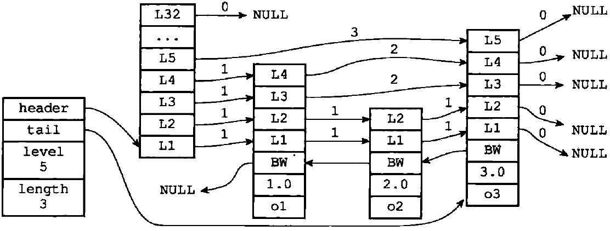

# Redis 常见面试题

简单来说 Redis 就是一个数据库，不过与传统数据库不同的是 Redis 的数据是存在内存中的，所以存写速度非常快，因此 Redis 被广泛应用于缓存方向。此外，redis 也经常用来做分布式锁。


## 为什么要用 Redis

**高性能**

假如用户第一次访问数据库中的某些数据。因为是从硬盘上读取的，所以这个过程会比较慢。我们可以将该用户这次访问的数据存在数缓存中，这样下一次再访问这些数据的时候就可以直接从缓存中获取了。操作缓存就是直接操作内存，所以速度相当快。如果数据库中的对应数据改变的之后，同步改变缓存中相应的数据即可！

**高并发**

高并发系统挂掉，多挂在数据库读写处，因为磁盘操作这个慢呀。直接操作缓存能够承受的请求是远远大于直接访问数据库的，所以我们可以考虑把数据库中的部分数据转移到缓存中去，这样用户的一部分请求会直接到缓存这里而不用经过数据库。


## 为什么要用 Redis 而不用 map 做缓存?

缓存分为本地缓存和分布式缓存。以 Java 为例，使用自带的 map 实现的是本地缓存，最主要的特点是轻量以及快速，生命周期随着 JVM 的销毁而结束，并且在多实例的情况下，每个实例都需要各自保存一份缓存，缓存不具有一致性。

使用 Redis 之类的称为分布式缓存，在多实例的情况下，各实例共用一份缓存数据，缓存具有一致性。缺点是需要保持 Redis 服务的高可用，会使整个程序的架构变的较为复杂。


## Redis 常见数据结构以及使用场景分析

### String

String 数据结构是简单的 key-value 类型，value 其实不仅可以是 String，也可以是数字。常规 key-value 缓存应用；常规计数：微博数，粉丝数等。

### List

双向链表，应用场景：微博的关注列表，粉丝列表，消息列表等。

#### 常用命令

```
lpush
rpush
lpop
rpop
blpop   # 阻塞 pop，bl：block
lrange  # LRANGE mylist 0 1，取出 list 0~1 的元素
llen
lrem
lindex  # 按 index get list 种的元素
linsert # LINSERT mylist BEFORE "World" "There"
lset    # LSET mylist 0 "four"，把第 0 个位置改成 "four"
```

#### 底层实现

链表。

### Hash

Hash 是一个 string 类型的 field 和 value 的映射表，又名字典，hash 特别适合用于存储对象，后续操作的时候，你可以直接仅仅修改这个对象中的某个字段的值。 比如我们可以Hash数据结构来存储用户信息，商品信息等等。

比如可以用 hash 类型存放：

```json
key=JavaUser293847
value={  // value 可以是一个 JSON 字符串
    "id": 1,
    "name": "SnailClimb",
    "age": 22,
    "location": "Wuhan, Hubei"
}
```

#### 常用命令

```
hset     # HSET myhash field1 "Hello"，field1 是 key，"Hello" 是 value
hget
hdel     # 就 hash 特别，删除叫 del，别人都叫 rem
hgetAll  # 返回所有的 field 和 value，顺序：field1，value1，field2，value2，field3，value3 ...
hexists
hkeys
hvals
hsetnx   # 字段不存在时才 set，字段存在不 set
```

#### 底层实现

- 哈希表，一个字典有两个哈希表（`ht[0]` & `ht[1]`），一个是平时用的，一个是 rehash 时用的。
- 插入一个新的键值对时，会先根据 key 计算出哈希值和索引值，然后把键值对发到对应索引处。
- 哈希算法：MurmurHash2，该算法即使输入的键是由规律的，也能给出一个很好的随机性，并且速度快。
- 解决键冲突：链地址法，每个哈希表节点有一个 next 指针，冲突的键会形成一个单链表。
- 为了让哈希表的负载因子维持在一个合理的范围，当哈希表保存的键值对数量太多或太少时，程序会对哈希表的大小进行相应的扩展或收缩，这个过程叫 rehash。步骤如下：
	- `ht[0]` 是现在正在用的哈希表，Redis 会根据 `ht[0]` 中当前包含的键值对个数（`ht[0].used`）为 `ht[1]` 分配空间，空间大小取决于：
		- 扩展操作：`ht[1].size = 第一个大于 ht[0].used * 2 的 2^n`
		- 收缩操作：`ht[1].size = 第一个大于 ht[0].used 的 2^n`
	- 将 `ht[0]` 上的键值对 rehash 到 `ht[1]` 上；
	- 将 `ht[1]` 设置为 `ht[0]`，并在 `ht[1]` 新创建一个空白哈希表用于下一次 rehash。

### Set

适用于无顺序的集合，点赞点踩，抽奖，已读，共同好友（适合用来去重）

#### 常用命令

```
sadd     # SADD myset one two three，可以一次 add 一坨
sinter   # 两个集合的交集，SINTER key1 key2，其中 key1 和 key2 是两个 set 名
sunion   # 两个集合的并集
sdiff    # 第一个集合 - 交集
smembers
sismember
srem     # 删除元素
smove    # 把一个set中的元素移动到另一个集合
scard    # 集合的size
srandmember  # SRANDMEMBER myset n，随机取 n 个，可以用来做抽奖，不写 n 就是随机取一个
```

#### 底层实现

Set 有两种类型，一种是 intset，就是整数集合，另一种是对象集合。

### Sorted Set

排行榜，优先队列（适合用来排序）

多个节点可以包含相同的 score，不过成员对象必须是唯一的。元素先按照 score 大小进行排序，score 相同时，按照成员对象大小（字典序之类的）进行排序。

#### 常用命令

```
zadd       # ZADD myzset 2 "two" 3 "three"
zcard      # 集合的 size
zcount     # 可以计算一个范围内数的 size
zscore     # 查询 key 的值
zincrby    # 做加减法，对不存在的值加分会默认新建该值，并且初始值为 0
zrange     # ZRANGE myzset 0 -1 WITHSCORES，排行功能，打印排行后的结果
zrevrange  # 反转 Set
zrank      # key 的正向排名
zrevrank   # key 的反向排名
# 遍历
for (Tuple tuple : jedis.zrangeByScoreWithScores(rankKey, "60", "100")) {
    print(37, tuple.getElement() + ":" + String.valueOf(tuple.getScore()));
}
```

#### 底层实现（跳跃表）

传说中的跳跃表。跳跃表（skiplist）是一种随机化的数据，跳跃表以有序的方式在层次化的链表中保存元素， 效率和平衡树媲美 —— 查找、删除、添加等操作都可以在对数期望时间下完成， 并且比起平衡树来说， 跳跃表的实现要简单直观得多。

首先说一下我们的需求，我们要一个有序的列表，因为一个有序的列表搜索起来可以用二分法，快啊！

所以当我们要插入新元素的时候，就不能直接往表尾一放，我们需要保证把这个节点放进去之后，这个表还是有序的，所以我们的插入操作要分两步来进行：

1. 找：把新节点插哪我们的表还是有序滴
2. 插：把新节点插到我们上一步找到的位置处

这需求一看就是平衡树了，可是红黑树之流实现起来有多复杂，大家也是有目共睹的，所以，Redis 用了一种叫跳跃表的数据结构。我们先来介绍一下 [跳跃表](http://blog.jobbole.com/111731/)（这个小灰讲的超好，我就是在下面挑我关心的重点复述一下）：

首先，本质上来讲，跳跃表还是一个链表的，这样插入和删除就很快啦！不过存链表的查找很慢呀，根本用不了二分法之流，只能从头到尾一个一个的遍历，也就是说，它的查找移动步长只能是 1，那么怎么解决这个问题呢？我们首先想到的方法应该就是想尽一切办法能让查找操作以比较大的步长移动。

那么如何实现大步长移动呢？这就想到了 MySQL 的 InnoDB 的索引的实现方式，我们知道 InnoDB 的一个数据页中的数据和一个链表差不多，不过它有一个叫页目录的东西，这个页目录就是从它所在的页中，以一定的间隔抽出一些节点，作为这个页的目录，这样我们就能大跨度的在单链表中进行查找了。

跳跃表就是基于这个方法实现的大跨度的查找，它从真正的数据中抽出了一些作为一级索引，又从一级索引中抽出一部分作为二级索引，就这样抽抽抽，知道最高层只有两个节点为止（就剩俩了也没有必要继续抽了……）。抽完之后大概是这样的：


那么我们抽索引的时候，抽谁呢？跳跃表是个选择障碍症患者，所以它抛硬币，每插入一个新节点，它都有 50% 的概率被选为索引，所以跳跃表的插入操作的是这样滴，比如我们要在上面的那个表里插个 9：


那么删除呢？删除超简单，比如说我们要删个 5，那么我们从最高层开始找 5：

- 第一层有 5，删了，然后这层就剩 1，然后干脆把这层都删了……
- 第二层有 5，删了
- 第三层有 5，删了，好了，删光了！


不过呢，Redis 的实现方式和上面描述的过程还是有区别的，Redis 实现跳跃表用了两种结构体：

- `zskiplistNode`：表示跳跃表节点；
- `zskiplist`：保存跳跃表的相关信息；

先来看一下 `zskiplistNode` 的定义：

```c
typedef struct zskiplistNode {
    /* 下面俩货是我们的数据，不多说了 */
    robj *obj;     // member 对象
    double score;  // 分值
    
    /* 后退指针，指向当前节点的前一个节点，用于从表尾向表头遍历跳跃表中的所有节点 */
    struct zskiplistNode *backward;
    
    /* 层数组，实现大幅度跳跃的关键 */
    /* 每个节点的层数组长度不一定，是一个 1~32 的随机数，是根据幂次定理随机的，就是说数越大，出现的概率越小 */
    /* 每一个节点的同一层组成一个单链表，就是那个前进指针，比如 level[3] 吧，它就指向下一个有 level[3] 的节点 */
    struct zskiplistLevel {
        struct zskiplistNode *forward;  // 前进指针
        unsigned int span;  // 这个层跨越的节点数量
                            // 不要小看这个东西，这个东西可以拿来计算排位 rank
                            // 在查找某个节点的过程中，将沿途访问过的所有层的跨度累计起来，
                            // 得到的结果就是目标节点在跳跃表中的排位
                            // 要是没有这个东西，鬼知道你在进行大步跨越时，跨越了多少节点啊
    } level[];
} zskiplistNode;
```

再来看一下 `zskiplist` 的定义：

```c
typedef struct zskiplist {
    struct zskiplistNode *header, *tail;  // 头节点，尾节点
    unsigned long length;                 // 节点数量
    int level;                            // 目前表内节点的最大层数
} zskiplist;
```

所以 Redis 的表看起来是这样子滴：



如果我们想要遍历整个跳跃表，就是把 L1 层的链表从头遍历到尾，过程如下图虚线所示：


如果我们想查找一个节点，比如 o2，我们的查找过程如下图虚线所示：


这下明白 Redis 的跳跃表了吧！


## Redis 设置过期时间


## Redis 内存淘汰机制

即 MySQL 里有 2000w 数据，Redis 中只存 20w 的数据，那么如何保证 Redis 中的数据都是热点数据呢？


## Redis 持久化机制

即怎么保证 Redis 挂掉之后再重启数据可以进行恢复？


## Redis 事务


## 缓存雪崩和缓存穿透问题解决方案


## 如何解决 Redis 的并发竞争 Key 问题


## 如何保证缓存与数据库双写时的数据一致性？


