# 设计模式

重点掌握的设计模式：

- [**单例模式**](#单例模式)
- [**代理模式**](#代理模式)
- **工厂模式**
	- [简单工厂](#简单工厂)
	- [工厂方法](#工厂方法)
	- [抽象工厂](#抽象工厂)
- [**适配器模式**](#适配器模式)
- [**外观模式**](#外观模式)
- [**装饰模式**](#装饰模式)
- [**策略模式**](#策略模式)
- [**观察者模式**](#观察者模式)


## UML 类图


- 车的类图结构为 abstract，表示车是一个抽象类；
- 它有两个继承类：小汽车和自行车；它们之间的关系为 **实现关系，使用带空心箭头的虚线表示**；
- 小汽车为与 SUV 之间也是 **继承关系**，它们之间的关系为泛化关系，**使用带空心箭头的实线表示**；
- 小汽车与发动机之间是 **组合关系，使用带实心箭头的实线表示**；
- 学生与班级之间是 **聚合关系，使用带空心箭头的实线表示**；
- 学生与身份证之间为 **关联关系，使用一根实线表示**；
- 学生上学需要用到自行车，与自行车是一种 **依赖关系，使用带箭头的虚线表示**；


## 设计模式的分类

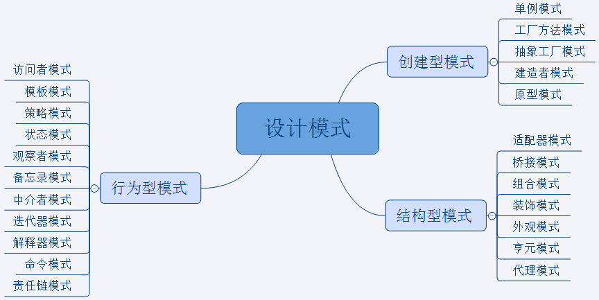

- **创建型模式：** 对象实例化的模式，创建型模式用于解耦对象的实例化过程。
  - [**单例模式**](#单例模式)：某个类只能有一个实例，提供一个全局的访问点。
  - **工厂模式**
  	- [简单工厂](#简单工厂)：一个工厂类根据传入的参量决定创建出那一种产品类的实例。
  	- [工厂方法](#工厂方法)：定义一个创建对象的接口，让子类决定实例化那个类。
  	- [抽象工厂](#抽象工厂)：创建相关或依赖对象的家族，而无需明确指定具体类。
  - [建造者模式](#建造者模式)：封装一个复杂对象的构建过程，并可以按步骤构造。
  - [原型模式](#原型模式)：通过复制现有的实例来创建新的实例。
- **结构型模式：** 把类或对象结合在一起形成一个更大的结构。
  - [**适配器模式**](#适配器模式)：将一个类的方法接口转换成客户希望的另外一个接口。
  - [**外观模式**](#外观模式)：对外提供一个统一的方法，来访问子系统中的一群接口。
  - [**组合模式**](#组合模式)：将对象组合成树形结构以表示“”部分-整体“”的层次结构。
  - [**装饰模式**](#装饰模式)：动态的给对象添加新的功能。
  - [**代理模式**](#代理模式)：为其他对象提供一个代理以便控制这个对象的访问。
  - [享元模式](#享元模式)：通过共享技术来有效的支持大量细粒度的对象。
  - [桥接模式](#桥接模式)：将抽象部分和它的实现部分分离，使它们都可以独立的变化。
- **行为型模式：** 类和对象如何交互，及划分责任和算法。
  - [**模板模式**](#模板模式)：定义一个算法结构，而将一些步骤延迟到子类实现。
  - [**迭代器模式**](#迭代器模式)：一种遍历访问聚合对象中各个元素的方法，不暴露该对象的内部结构。
  - [**策略模式**](#策略模式)：定义一系列算法，把他们封装起来，并且使它们可以相互替换。
  - [**状态模式**](#状态模式)：允许一个对象在其对象内部状态改变时改变它的行为。
  - [**观察者模式**](#观察者模式)：对象间的一对多的依赖关系。
  - [解释器模式](#解释器模式)：给定一个语言，定义它的文法的一种表示，并定义一个解释器。
  - [备忘录模式](#备忘录模式)：在不破坏封装的前提下，保持对象的内部状态。
  - [中介者模式](#中介者模式)：用一个中介对象来封装一系列的对象交互。
  - [命令模式](#命令模式)：将命令请求封装为一个对象，使得可以用不同的请求来进行参数化。
  - [访问者模式](#访问者模式)：在不改变数据结构的前提下，增加作用于一组对象元素的新功能。
  - [责任链模式](#责任链模式)：将请求的发送者和接收者解耦，使的多个对象都有处理这个请求的机会。


## 单例模式

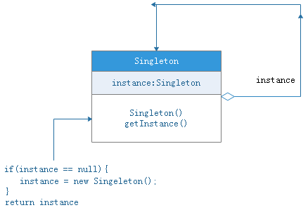

### 懒汉式（线程不安全）

```java
public class Singleton {
    private static Singleton instance;
    private Singleton (){}

    public static Singleton getInstance() {
        if (instance == null) {
            instance = new Singleton();
        }
        return instance;
    }
}
```

### 懒汉式（线程安全）

```java
public static synchronized Singleton getInstance() {
    if (instance == null) {
        instance = new Singleton();
    }
    return instance;
}
```

### 双重检验锁

```java
public class Singleton {
    private volatile static Singleton instance; // 声明成 volatile
    private Singleton (){}

    public static Singleton getSingleton() {
        if (instance == null) {
            synchronized (Singleton.class) {
                if (instance == null) {
                    instance = new Singleton();
                }
            }
        }
        return instance;
    }
}
```


### 饿汉式 static final field

```java
public class Singleton{
    private static final Singleton instance = new Singleton(); // 类加载时就初始化
    private Singleton(){}

    public static Singleton getInstance(){
        return instance;
    }
}
```

### 静态内部类 static nested class

```java
public class Singleton {  
    private static class SingletonHolder {  
        private static final Singleton INSTANCE = new Singleton();  
    }
    
    private Singleton (){}
    
    public static final Singleton getInstance() {  
        return SingletonHolder.INSTANCE; 
    }
}
```

这种写法仍然使用 JVM 本身机制保证了线程安全问题；由于 SingletonHolder 是私有的，除了 getInstance() 之外没有办法访问它，因此它是懒汉式的；同时读取实例的时候不会进行同步，没有性能缺陷；也不依赖 JDK 版本。

### 枚举 Enum

```java
public enum EasySingleton{
    INSTANCE;
}
```

通过 `EasySingleton.INSTANCE` 来访问实例。


## 简单工厂

简单工厂并不是一个设计模式，而是一种编程习惯。


## 工厂方法

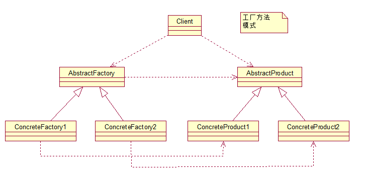

作为抽象工厂模式的孪生兄弟，工厂方法模式定义了一个创建对象的接口，但由子类决定要实例化的类是哪一个，也就是说工厂方法模式让实例化推迟到子类。

工厂方法模式非常符合“开闭原则”，当需要增加一个新的产品时，我们只需要增加一个具体的产品类和与之对应的具体工厂即可，无须修改原有系统。同时在工厂方法模式中用户只需要知道生产产品的具体工厂即可，无须关系产品的创建过程，甚至连具体的产品类名称都不需要知道。虽然他很好的符合了“开闭原则”，但是由于每新增一个新产品时就需要增加两个类，这样势必会导致系统的复杂度增加。


## 抽象工厂

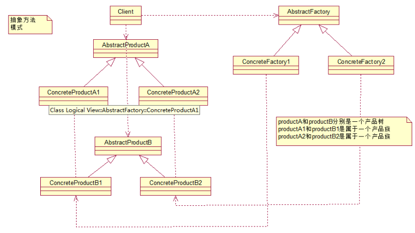

所谓抽象工厂模式就是提供一个接口，用于创建相关或者依赖对象的家族，而不需要明确指定具体类。他允许客户端使用抽象的接口来创建一组相关的产品，而不需要关系实际产出的具体产品是什么。这样一来，客户就可以从具体的产品中被解耦。

它的优点是隔离了具体类的生成，使得客户端不需要知道什么被创建了，而缺点就在于新增新的行为会比较麻烦，因为当添加一个新的产品对象时，需要更加需要更改接口及其下所有子类。


## 建造者模式

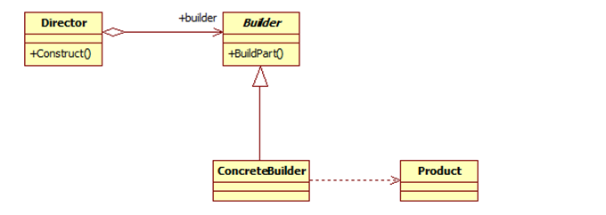

对于建造者模式而已，它主要是将一个复杂对象的构建与表示分离，使得同样的构建过程可以创建不同的表示。适用于那些产品对象的内部结构比较复杂。

建造者模式将复杂产品的构建过程封装分解在不同的方法中，使得创建过程非常清晰，能够让我们更加精确的控制复杂产品对象的创建过程，同时它隔离了复杂产品对象的创建和使用，使得相同的创建过程能够创建不同的产品。但是如果某个产品的内部结构过于复杂，将会导致整个系统变得非常庞大，不利于控制，同时若几个产品之间存在较大的差异，则不适用建造者模式，毕竟这个世界上存在相同点大的两个产品并不是很多，所以它的使用范围有限。


## 原型模式

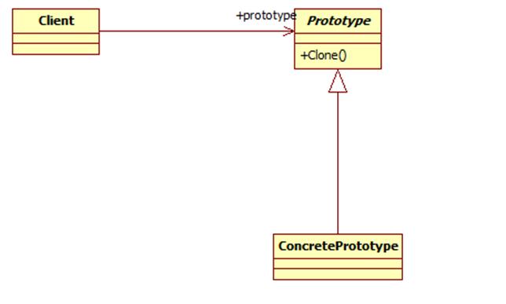


## 适配器模式


在我们的应用程序中我们可能需要将两个不同接口的类来进行通信，在不修改这两个的前提下我们可能会需要某个中间件来完成这个衔接的过程。这个中间件就是适配器。所谓适配器模式就是将一个类的接口，转换成客户期望的另一个接口。它可以让原本两个不兼容的接口能够无缝完成对接。

作为中间件的适配器将目标类和适配者解耦，增加了类的透明性和可复用性。


## 外观模式

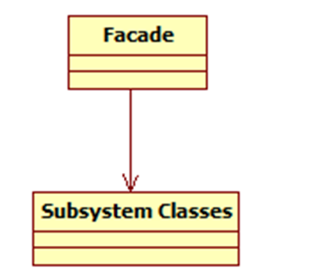


## 组合模式

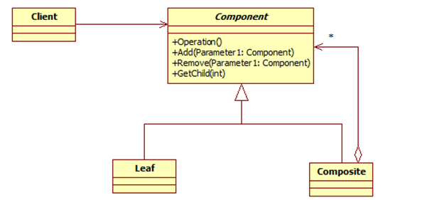


## 装饰模式

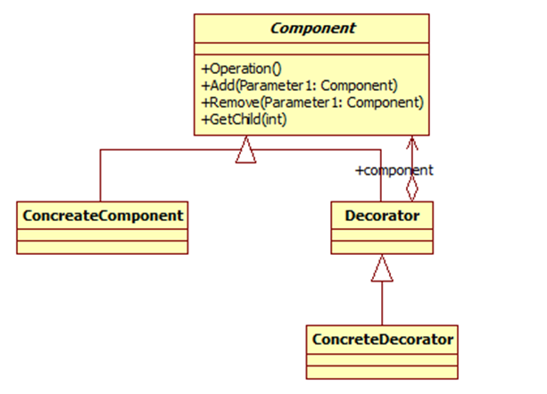


## 代理模式

为另一个对象提供一个替身或占位符以控制对这个对象的访问。


- Proxy 中有一个 RealSubject 对象，我们拿不到 RealSubject 对象，只能拿到 Proxy 对象；
- Proxy 和 RealSubject 都实现了 Subject 接口，它们有相同的方法；
- 我们通过 Proxy 对象调用 RealSubject 对象的方法，不过在调用前，Proxy 会先检查一下这个调用合不合理，不合理它就不调用 RealSubject 对象的方法。


## 享元模式

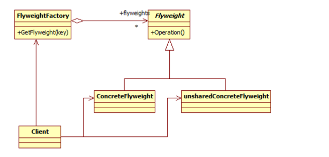


## 桥接模式

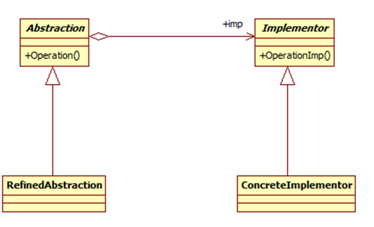


## 模板模式

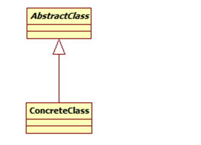


## 迭代器模式

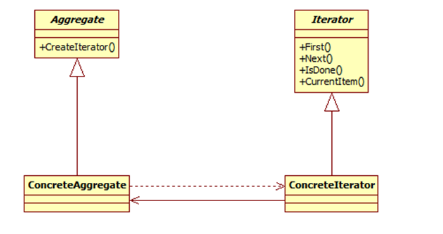


## 策略模式

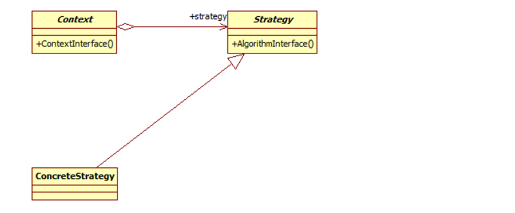


## 状态模式

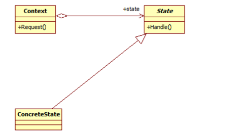


## 观察者模式

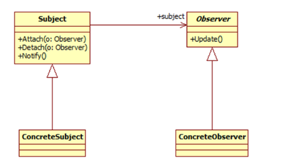


## 解释器模式

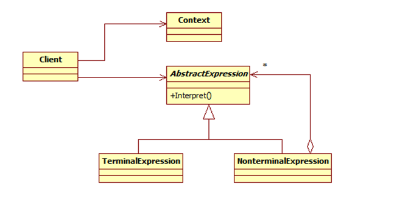


## 备忘录模式


## 中介者模式


## 命令模式


## 访问者模式

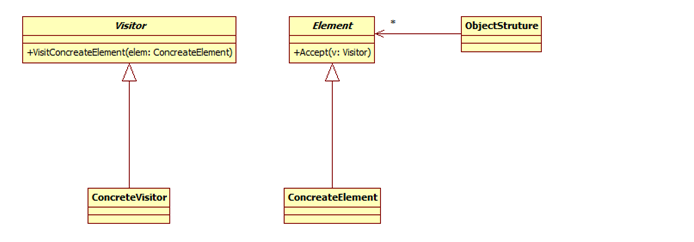


## 责任链模式

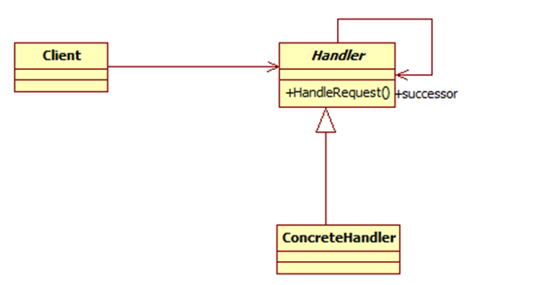


**参考：**

- [图说设计模式](https://design-patterns.readthedocs.io/zh_CN/latest/)
- [JAVA设计模式总结之23种设计模式](https://www.cnblogs.com/pony1223/p/7608955.html)
- [如何正确地写出单例模式](http://wuchong.me/blog/2014/08/28/how-to-correctly-write-singleton-pattern/)

